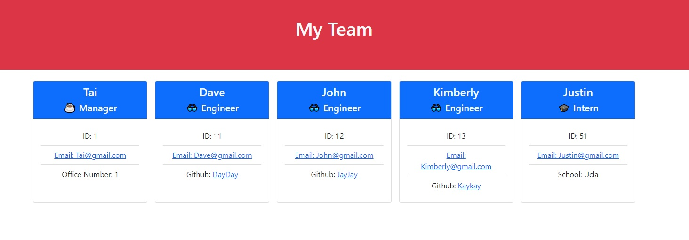

  # Team Profile Gen 
  ## Description 
  An app that lets you generate a profile of your team that includes their names, id, roles, email and/or github.
  ## Tables of Contents
  * [Installation](#installation)
  * [Usage](#usage)
  * [License](#license)
  * [Questions](#questions)
  
  ## Installation 
  * [Npm Inquirer](https://www.npmjs.com/package/inquirer)
  * Git clone from repo
  * Type 'npm i' in the terminal/gitbash

  ## Usage
  * Type 'node index.js' in the terminal/gitbash
  * Answer the prompts
  * File should be created in the dist folder
  * [Link for video guide](https://drive.google.com/file/d/1B8fNBJH960c0BfA__fbhsf-7HbK9Wo61/view)
  
  ## Credits
  Stackoverflow.com

  ## Example
  

  ## Questions
  For any questions please reach out to 
  github: [AyoTai](https://github.com/AyoTai)
  email: taimujarin@gmail.com
  ## License 
  ### No License
  
